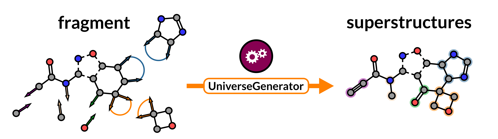

# UniverseGenerator : Build Superstructures for Any Fragment

The UniverseGenerator builds all possible superstructures of a fragment that have N additional heavy atoms.



A more detailed description of the algorithm can be found in the corresponding [paper](https://doi.org/some_number). Compound libraries are available on [Zenodo](https://doi.org/some_number).

# Table of contents

- [UniverseGenerator : Build Superstructures for Any Fragment](#universegenerator--build-superstructures-for-any-fragment)
- [Table of contents](#table-of-contents)
- [Dependencies](#dependencies)
- [Installation](#installation)
- [Example Superstructure Generation](#example-superstructure-generation)
  - [1. Generating Graphs](#1-generating-graphs)
  - [2. Eliminating Strained Hydrocarbons](#2-eliminating-strained-hydrocarbons)
  - [3. Introducing Unsaturations](#3-introducing-unsaturations)
  - [4. Introducing Heteroatoms](#4-introducing-heteroatoms)
  - [5. Introducing Decorations](#5-introducing-decorations)
  - [6. Activating Substituents](#6-activating-substituents)
  - [7. Activating a Scaffold](#7-activating-a-scaffold)
  - [8. Coupling Substituents to a Scaffold](#8-coupling-substituents-to-a-scaffold)
- [Additional information](#additional-information)
- [Troubleshooting](#troubleshooting)
- [Citing our work](#citing-our-work)

# Dependencies
* [CMake](https://cmake.org/)
* [C++17](https://isocpp.org/) compliant compiler
* [Boost](https://www.boost.org/) (>= 1.83.0).
* [RDKit](https://rdkit.org/) (>= 2021.03.2)
* [Nauty](https://pallini.di.uniroma1.it/)

The versions listed above have been tested to work on MacOS Ventura 13.2.1 and Rocky Linux 9.4 (Blue Onyx).

# Installation
The following sections assume you are installing the UniverseGenerator on a GNU/Linux machine.

Clone the repository, and the resulting directory will be referred to as `${UniverseGenerator}`.

```bash
# Get the UniverseGenerator source code
git clone https://github.com/carlssonlab/UniverseGenerator/UniverseGenerator.git

# Define its location
export UniverseGenerator=$PWD/UniverseGenerator
```

Install the dependencies via conda:

```bash
cd ${UniverseGenerator}

# Create a new conda environment
conda create -n universe

# Activate the UniverseGenerator environment
conda activate universe

# Install dependencies, some might not be necessary (Python related)
conda install numpy matplotlib cmake cairo pillow eigen pkg-config boost-cpp boost

# Some useful packages
pip install yapf==0.11.1
pip install coverage==3.7.1

# Obtain the RDKit source code
git clone https://github.com/rdkit/rdkit.git

# Start of RDKit installation
cd rdkit
mkdir build && cd build

# Prepare the Makefiles, don't need any Python bindings
cmake -DRDK_INSTALL_INTREE=ON -DRDK_INSTALL_STATIC_LIBS=OFF -DRDK_BUILD_CPP_TESTS=ON -DBOOST_ROOT="${CONDA_PREFIX}" ..

# Build the software
make

# Install the software (Number of cores = 4)
make -j4 install
```

If you have issues installing RDKit from source, [this blogpost](https://greglandrum.github.io/rdkit-blog/posts/2023-03-17-setting-up-a-cxx-dev-env2.html) might be useful. Alternatively RDKit can be installed via conda (Python3.10).

Install the dreadnaut through running the following command:
```bash
bash ${UniverseGenerator}/scripts/install_nauty.sh
```

If you installed RDKit and Boost through Anaconda, make sure you have environment variables `${RDBASE}` and `${BOOSTBASE}` pointing to RDKit and Boost's root directories:
```bash
# RDKit root dir
if [ -z "${RDBASE}" ]; then
    echo "RDBASE is not set!\nLooking in UniverseGenerator folders"
    export RDBASE=${UniverseGenerator}/rdkit
fi

# Boost root dir
if [ -z "${BOOSTBASE}" ]; then 
    echo "BOOSTBASE is not set!\nLooking in conda env"
    export BOOSTBASE=${CONDA_PREFIX}
fi
```

You can install openbabel for conformation embedding with:
```bash
# First add the conda-forge
conda config --add channels conda-forge

# Now you can conda install openbabel
conda install openbabel
```

You can now build the UniverseGenerator executables as follows:

```bash
# Link RDKit and conda
if [[ "$(uname)" == "Darwin" ]]; then
    export DYLD_LIBRARY_PATH=$RDBASE/lib:$CONDA_PREFIX/lib
elif [[ "$(uname)" == "Linux" ]]; then
    export LD_LIBRARY_PATH=$RDBASE/lib:$CONDA_PREFIX/lib
else
    echo "Unknown OS."
fi

# Build Universe executables
bash ${UniverseGenerator}/scripts/prepare_universe.sh
```

# Example Superstructure Generation
Prior to any UniverseGenerator calculations, remember to set all environment variables, even after installation:
```bash
# Set environment variables
bash ${UniverseGenerator}/scripts/set_environments.sh
```
You can find examples of each step in the superstructure generation in the [demo](demo) directory.

Enter the example directory:
```bash
# Enter directory
cd ${UniverseGenerator}/demo

# Create shortcut variable for demo folder
export demo=${UniverseGenerator}/demo
```

## 1. Generating Graphs
The first step is to generate (planar) graphs using [*Nauty*](https://pallini.di.uniroma1.it/)'s *geng* and *planarg* toolkits. To generate planar graphs with, for example `five nodes` (carbons) and at most four edges, run the following command:

```bash
# Create planar g6 graphs
${UniverseGenerator}/bin/geng -cd1D4 5 | ${UniverseGenerator}/bin/planarg > ${demo}/1.generate/input.convert.g6
```
The resulting [graphs](demo/1.generate/reference.input.convert.g6) are stored in the [**g6**](https://reference.wolfram.com/language/ref/format/Graph6.html) format. The adjacency matrices corresponding to these graphs can be visualized by:

```bash
# Show adjacency matrix
${UniverseGenerator}/bin/showg -a ${demo}/1.generate/input.convert.g6
```
The g6 graphs can be transformed into (hydrocarbon) [SMILES](demo/1.generate/reference.output.convert.smi) with the following command:

```bash
# Convert g6 graph to SMILES
${UniverseGenerator}/bin/showg -a ${demo}/1.generate/input.convert.g6 | ${UniverseGenerator}/bin/adjmat2smiles -o ${demo}/1.generate/output.convert.smi

# Unfortunately, this cannot be a symbolic link
cp ${demo}/1.generate/output.convert.smi ${demo}/1.generate/input.embed.smi
```

The resulting SMILES are then embedded into 3D conformations by the [CORINA](https://mn-am.com/products/corina/), [molconvert](https://docs.chemaxon.com/display/docs/molconvert_index.md), or [openbabel](https://openbabel.org/index.html#) toolkit using either one of the following commands:

```bash
# Corina
${UniverseGenerator}/bin/corina -i t=smiles ${demo}/1.generate/input.embed.smi -o t=mol2 ${demo}/1.generate/output.embed.mol2 -d mc=1, wh

# Molconvert
${UniverseGenerator}/bin/molconvert -3:[prehydrogenize][S]{fine} -g mol2 ${demo}/1.generate/input.embed.ism -o ${demo}/1.generate/output.embed.mol2

# Openbabel
obabel -ismi ${demo}/1.generate/input.embed.smi -omol2 -O ${demo}/1.generate/output.embed.mol2 --gen3D

# Symbolic link for next step
ln -s ${demo}/1.generate/output.embed.mol2 ${demo}/2.strain/input.eliminate.mol2
```

## 2. Eliminating Strained Hydrocarbons
Some hydrocarbons will have a topology that cannot be easily embedded into a relaxed 3D conformation and will therefore likely lead to chemically unstable molecules. Strained conformations are filtered out by calculating the smallest atomic volume defined by all-carbon tetrahedrons in the hydrocarbon. Those with an atomic volume smaller than 0.345 Å<sup>3</sup> are discarded by the following command:

```bash
# Eliminate strained conformations
${UniverseGenerator}/bin/eliminate-strained -i ${demo}/2.strain/input.eliminate.mol2 -o ${demo}/2.strain/output.eliminate.smi

# Symbolic link for next step
ln -s ${demo}/2.strain/output.eliminate.smi ${demo}/3.unsaturate/input.unsaturate.smi
```

The threshold volume (default = 0.345 Å<sup>3</sup>) can be adjusted by providing a value through the `-t` flag:
```bash
# Adjust smallest atomic volume threshold
${UniverseGenerator}/bin/eliminate-strained -i ${demo}/2.strain/input.eliminate.mol2 -o ${demo}/2.strain/output.eliminate.smi -t 0.400
```

## 3. Introducing Unsaturations
To generate all unsaturated analogs of [hydrocarbons](demo/2.strain/reference.output.eliminate.smi), run the following command:

```bash
# Introduce unsaturations in saturated hydrocarbons
${UniverseGenerator}/bin/unsaturate -i ${demo}/3.unsaturate/input.unsaturate.smi -o ${demo}/3.unsaturate/output.unsaturate.smi

# Symbolic link for next step
ln -s ${demo}/3.unsaturate/output.unsaturate.smi ${demo}/4.functionalize/input.functionalize.smi
```

## 4. Introducing Heteroatoms
To insert heteroatoms (N & O) in [(unsaturated) hydrocarbons](demo/3.unsaturate/reference.output.unsaturate.smi) and remove patterns found in the [functionality_filter](auxiliaries/functionality_filter.tsv), run the following command:

```bash
# Introduce heteroatoms in hydrocarbons and filter out patterns from filter_file.tsv
${UniverseGenerator}/bin/functionalize -i ${demo}/4.functionalize/input.functionalize.smi \
                                       -o ${demo}/4.functionalize/output.functionalize.smi \
                                       -f ${UniverseGenerator}/auxiliaries/functionality_filter.tsv

# Symbolic link for next step
ln -s ${demo}/4.functionalize/output.functionalize.smi ${demo}/5.decorate/input.decorate.smi
```

## 5. Introducing Decorations
To further decorate functionalized molecules based on the reaction patterns found in [reaction_library](auxiliaries/reaction_library.tsv) and a total of `N = [1,2,3,...]` heavy atoms, run the following command:

```bash
# Introduce decorations in molecules (with 5 heavy atoms) based on reaction patterns in smirks_library.tsv
${UniverseGenerator}/bin/decorate -i ${demo}/5.decorate/input.decorate.smi -o ${demo}/5.decorate/output.decorate.smi -r ${UniverseGenerator}/auxiliaries/reaction_library.tsv -n 5

# Symbolic link for next step
ln -s ${demo}/5.decorate/output.decorate.smi ${demo}/6.substituents/input.substituents.smi
```

If you want to introduce other functional groups, you can modify the [file](auxiliaries/reaction_library.tsv) containing the chemical transformations and add new [SMIRKS](https://www.daylight.com/dayhtml/doc/theory/theory.smirks.html) patterns. 

## 6. Activating Substituents
To activate [substituents](demo/6.substituents/reference.input.substituents.smi) in a library for coupling to a scaffold, run the following command:
```bash
# Activate substituents for coupling onto a scaffold
${UniverseGenerator}/bin/activate-substituents -i ${demo}/6.substituents/input.substituents.smi -o ${demo}/6.substituents/output.substituents.smi
```

## 7. Activating a Scaffold
To prepare a [fragment scaffold](demo/7.scaffold/scaffold.smi) for superstructure generation, run the following command:
```bash
# Activate a scaffold for coupling with substituent libraries
${UniverseGenerator}/bin/activate-scaffold -i ${demo}/7.scaffold/input.scaffold.smi -o ${demo}/7.scaffold/output.scaffolds.smi

# Symbolic link for next step
ln -s ${demo}/7.scaffold/output.scaffolds.smi ${demo}/8.superstructure/input.scaffolds.smi
```

## 8. Coupling Substituents to a Scaffold
The first step is to link the [activated substituent libraries](demo/6.substituents/reference.output.substituents.smi).
```bash
# Get the substituent libraries
bash ${UniverseGenerator}/scripts/fetch_substituents.sh
```

The second step in building superstructure molecules is creating instructions on how to make compounds with a total of `N heavy atoms` using a series of [activated scaffolds](demo/7.scaffold/reference.output.scaffolds.smi) and [activated substituent libraries](auxiliaries/substituents/substituents.list). To add **5** heavy atoms to your scaffold, run the following command: 
```bash
# Generate instructions for coupling substituents onto activated scaffolds, where the target products are composed of 15 heavy atoms
${UniverseGenerator}/bin/build-instructions -i ${demo}/8.superstructure/input.scaffolds.smi -o ${demo}/8.superstructure/superstructure-instructions.csv -n 15
```
In the third step (which can be effectively parallelized on a HPC) the [instructions](demo/8.superstructure/reference.superstructure-instructions.csv) derived in the second step are carried out and [valid superstructures](demo/8.superstructure/reference.output.superstructures.smi) are generated. This is achieved through the following command:

```bash
# Execute the couplings found in the instruction files
${UniverseGenerator}/bin/build-superstructures -i ${demo}/8.superstructure/superstructure-instructions.csv -o ${demo}/8.superstructure/output.superstructures.smi -f ${UniverseGenerator}/auxiliaries/superstructure_filter.tsv
```

# Additional information
For another description of generated databases, we refer to the [GDB17 paper](https://doi.org/10.1021/ci300415d).

# Troubleshooting
If you have any problems, questions or suggestions please open a GitHub Issue/Discussion.

# Citing our work
If you use the UniverseGenerator in your research, please cite our work as follows: [Luttens, A., *et al* Virtual Fragment Screening for DNA repair inhibitors in Vast Chemical Space. Journal Abbrev (2024). https://doi.org/some_number](https://doi.org/some_number).


Thank you for your interest in our work!

Happy modeling! ~ Andreas
